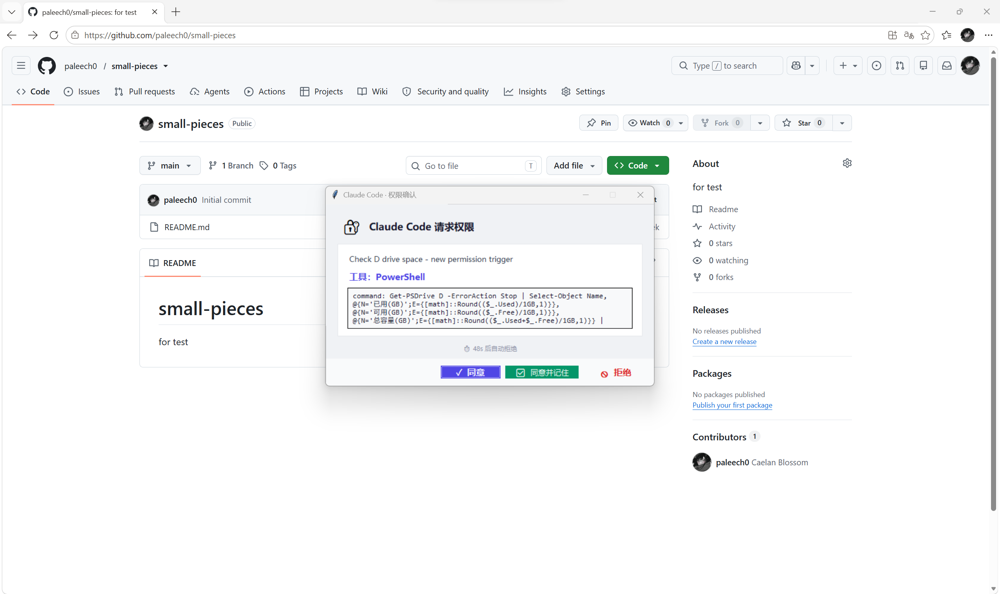

# Claude Code Popup Notify

把 Claude Code 的权限申请变成 Windows 桌面弹窗——后台运行时不错过权限确认，前台时自动静默不打扰。

> 灵感来自 [KYinCode/claude-code-popup-hooks](https://github.com/KYinCode/claude-code-popup-hooks)，在其基础上重构并大幅增强。



## 功能特性

- **权限弹窗**：CC 申请权限时弹出交互式窗口，显示中文概述 + 工具名 + 命令详情
- **空闲通知**：CC 完成任务等待输入时弹窗提醒，6 秒自动消失
- **前台检测**：终端在前台时自动跳过弹窗，不打扰当前工作（Windows 完整支持）
- **超时机制**：60 秒未操作自动拒绝，带实时倒计时
- **静默模式**：一键将弹窗最小化到任务栏，不抢焦点，点任务栏图标可恢复
- **空闲屏蔽**：空闲通知可临时关闭，重启 CC 后自动恢复（同一会话内有效）
- **记住规则**：「同意并记住」将权限规则持久化到本地设置，下次自动通过
- **键盘快捷键**：`Enter` 同意 · `Esc` 拒绝 · `Ctrl+Enter` 同意并记住

## 安装前提

- **Python 3**（任一版本均可）
- **无需 pip install**——仅依赖标准库（`tkinter`、`ctypes`、`json` 等）
- Windows / macOS / Linux 均可运行（前台检测仅 Windows 完整支持）

## 安装

### 方式一：一行命令（推荐）

**Windows（PowerShell）：**

```powershell
md "$env:USERPROFILE\.claude\hooks" -Force; Invoke-WebRequest -Uri "https://raw.githubusercontent.com/paleech0/small-pieces/master/cc-notify.py" -OutFile "$env:USERPROFILE\.claude\hooks\cc-notify.py"
```

**macOS / Linux：**

```bash
mkdir -p ~/.claude/hooks && curl -o ~/.claude/hooks/cc-notify.py https://raw.githubusercontent.com/paleech0/small-pieces/master/cc-notify.py
```

然后用下面的配置完成安装。

### 方式二：安装脚本（Windows）

下载仓库中的 `install.ps1`，右键 → 使用 PowerShell 运行。脚本会自动完成下载和配置。

### 配置 hooks

在 `~/.claude/settings.json` 中添加以下配置。如果文件已有其他内容，将 `"hooks"` 块合并进去：

```json
{
  "hooks": {
    "PermissionRequest": [
      {
        "matcher": "",
        "hooks": [
          {
            "type": "command",
            "command": "python ~/.claude/hooks/cc-notify.py"
          }
        ]
      }
    ],
    "Notification": [
      {
        "matcher": "idle_prompt",
        "hooks": [
          {
            "type": "command",
            "command": "python ~/.claude/hooks/cc-notify.py"
          }
        ]
      }
    ]
  }
}
```

> **Windows 用户**：将 `~/.claude/` 改为 `C:/Users/你的用户名/.claude/`。
> **项目级使用**：路径改为 `.claude/hooks/cc-notify.py`，配置写在 `.claude/settings.json`。

### 验证

重启 Claude Code，在 CC 中输入 `/hooks` 查看是否加载成功。

配置在 CC 启动时加载，重启后生效。可在 CC 中输入 `/hooks` 验证配置是否加载成功。

## 弹窗说明

### 权限申请弹窗

当 Claude Code 需要调用工具（Bash、PowerShell、Write 等）时弹出。

| 按钮 | 行为 |
|------|------|
| **✓ 同意** | 仅本次允许，不保存规则 |
| **✅ 同意并记住** | 允许并将规则写入本地设置，以后同类操作自动通过 |
| **🚫 拒绝** | 阻止本次操作 |
| **🔇 静默** | 开启静默模式，此后弹窗最小化到任务栏 |

### 空闲通知弹窗

当 Claude Code 完成响应、等待下一条指令时弹出。

| 按钮 | 行为 |
|------|------|
| **知道了** | 关闭弹窗 |
| **🔕 以后不再提醒** | 关闭本次会话的空闲通知（重启 CC 后恢复） |
| **🔊 静默模式** | 开启静默模式，此后所有弹窗最小化 |

### 静默模式

开启后所有弹窗不再抢占焦点，而是最小化到任务栏。点击任务栏图标即可恢复窗口进行操作。

- 切换方式：空闲通知上点「静默模式」或在权限弹窗右下角点「🔇 静默」
- 持久性：**永久有效**，重启 CC 不丢失，直到手动关闭

## 键盘快捷键

| 快捷键 | 作用 |
|--------|------|
| `Enter` | 同意 |
| `Escape` | 拒绝 |
| `Ctrl + Enter` | 同意并记住 |

## 跨平台支持

| 平台 | 弹窗 | 前台检测 | 检测方式 |
|------|------|----------|----------|
| Windows | ✅ tkinter | ✅ 完整支持 | Win32 API（窗口类名 + 进程名） |
| macOS | ✅ tkinter | ✅ 支持 | AppleScript 查询前台应用名 |
| Linux | ✅ tkinter | ✅ 支持 | xdotool 查询前台窗口类名 |

> **已知局限**：VS Code / Cursor 内置终端将终端嵌在编辑器主窗口中，无法区分用户是在看终端还是写代码。这些场景下前台检测无效，始终弹窗。

## 工作原理

> **注意**：Claude Code 处于自动模式（如 `--dangerously-skip-permissions` 或 `/loop`）时，CC 会跳过权限申请直接执行，不会触发 PermissionRequest 事件，因此不会弹窗。这是 CC 自身的行为，无需 hook 额外干预。

```
Claude Code 事件触发
    │
    ├─ PermissionRequest → cc-notify.py 读取 stdin JSON
    │                           │
    │                           ├─ 前台检测（终端在前台？）
    │                           │   ├─ 是 → 静默退出，CC 原生提示
    │                           │   └─ 否 → GUI 弹窗
    │                           │
    │                           └─ 用户点击按钮 → stdout JSON → CC
    │
    └─ Notification (idle_prompt) → cc-notify.py
                                        │
                                        ├─ 已屏蔽？→ 跳过
                                        └─ 未屏蔽 → 轻量弹窗（6s 自动消失）
```

## 文件说明

| 文件 | 用途 |
|------|------|
| `cc-notify.py` | 主脚本，~450 行纯 Python |
| `cc-notify_error.log` | 错误日志（自动生成） |
| `cc-notify_muted.json` | 空闲屏蔽标记（自动生成） |
| `cc-notify_quiet` | 静默模式标记（手动或通过界面切换） |

## License

MIT
